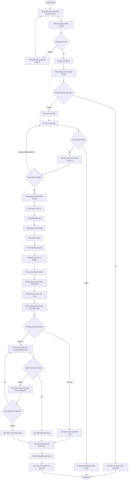
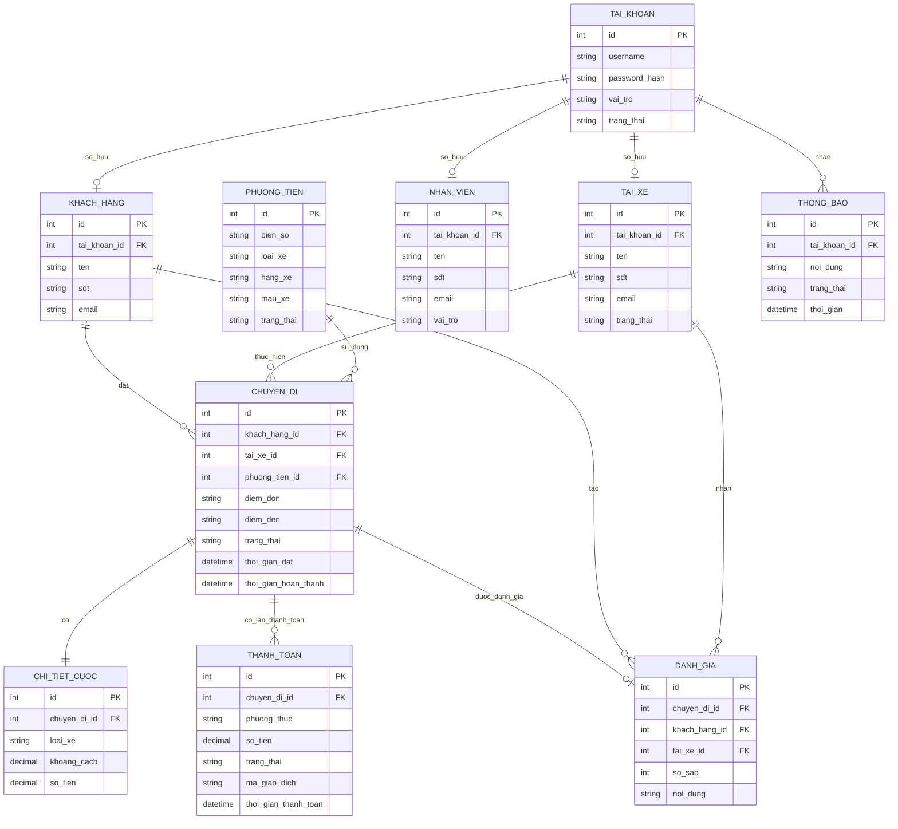
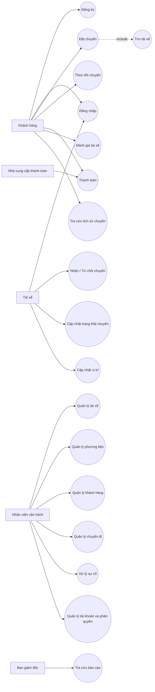

# B1. Ngữ cảnh nghiệp vụ và vấn đề nghiệp vụ

## 1. Ngữ cảnh nghiệp vụ

Công ty ABC cung cấp dịch vụ **đặt xe trực tuyến**. Hệ thống hiện tại cho phép khách hàng đặt xe qua tổng đài hoặc ứng dụng đơn giản nhưng còn nhiều hạn chế.

**Các bên sử dụng chính:**

* Khách hàng
* Tài xế
* Nhân viên vận hành

**Quy trình chính:**

`Đặt xe → Tìm tài xế → Nhận chuyến → Thực hiện chuyến → Tính cước → Thanh toán → Đánh giá`

## 2. Vấn đề nghiệp vụ

* Phân công tài xế chủ yếu **thủ công**, mất thời gian và khó mở rộng.
* Khách hàng **khó theo dõi trạng thái chuyến đi** và vị trí tài xế.
* Thông tin **thanh toán chưa được quản lý tập trung**.
* Nhân viên vận hành **khó giám sát và xử lý sự cố**.
* Hệ thống cũ **khó mở rộng** khi số lượng khách hàng, tài xế và chuyến đi tăng.
* Thiếu dữ liệu và báo cáo để **hỗ trợ quản lý, ra quyết định**.

## 3. Khách hàng muốn giải quyết

* Tự động hóa việc **tìm và phân công tài xế**.
* Cho khách hàng **theo dõi chuyến đi**.
* Quản lý **tính cước và thanh toán tập trung**.
* Hỗ trợ nhân viên **quản lý khách hàng, tài xế, phương tiện và chuyến đi**.
* Xây dựng nền tảng **có khả năng mở rộng và phát triển lâu dài**.

## 4. Mục tiêu kinh doanh

* **Tăng hiệu quả vận hành**.
* **Cải thiện trải nghiệm khách hàng**.
* **Giảm thời gian và công việc thủ công**.
* **Giảm tỷ lệ chuyến hủy/thất bại**.
* **Tăng khả năng kiểm soát hoạt động**.
* **Hỗ trợ ra quyết định bằng dữ liệu**.
* Có khả năng **mở rộng quy mô và bổ sung dịch vụ mới**.

## 5. Giá trị hệ thống mới so với hệ thống cũ

| Hệ thống cũ               | Hệ thống CAB mới           | Giá trị                       |
| ------------------------- | -------------------------- | ----------------------------- |
| Phân công tài xế thủ công | Tự động tìm tài xế         | Tiết kiệm thời gian           |
| Khó theo dõi chuyến       | Theo dõi trạng thái chuyến | Tăng trải nghiệm              |
| Thanh toán chưa tập trung | Quản lý thanh toán         | Dễ kiểm soát giao dịch        |
| Khó xử lý tài xế từ chối  | Tự động tìm tài xế khác    | Giảm thất bại                 |
| Khó giám sát              | Giao diện vận hành         | Tăng hiệu quả quản lý         |
| Báo cáo hạn chế           | Báo cáo hoạt động          | Hỗ trợ ra quyết định          |
| Khó mở rộng               | Kiến trúc linh hoạt        | Dễ phát triển trong tương lai |

## 6. Tóm tắt

> **Vấn đề:** Hệ thống cũ còn thủ công, khó theo dõi, khó quản lý và khó mở rộng.
> **Nhu cầu:** Tự động hóa quy trình đặt xe và quản lý tập trung.
> **Mục tiêu:** Tăng hiệu quả vận hành, cải thiện trải nghiệm khách hàng và hỗ trợ tăng trưởng.
> **Giá trị:** Tiết kiệm thời gian, giảm sai sót/thất bại, tăng khả năng kiểm soát và tạo nền tảng linh hoạt cho tương lai.

# B2. Xác định các bên liên quan

## 1. Danh sách các bên liên quan

| Bên liên quan                    | Vai trò                                                                              |
| -------------------------------- | ------------------------------------------------------------------------------------ |
| **Ban giám đốc Công ty ABC**     | Định hướng, xác định mục tiêu kinh doanh, phê duyệt dự án và theo dõi kết quả        |
| **Nhân viên vận hành**           | Quản lý khách hàng, tài xế, phương tiện, chuyến đi và xử lý các trường hợp phát sinh |
| **Khách hàng**                   | Đăng ký, đặt xe, theo dõi chuyến, thanh toán và đánh giá tài xế                      |
| **Tài xế**                       | Nhận chuyến, thực hiện chuyến, cập nhật trạng thái và thông tin vị trí               |
| **Nhà cung cấp thanh toán**      | Cung cấp dịch vụ thanh toán điện tử và xử lý giao dịch                               |
| **Nhà cung cấp thông báo**       | Cung cấp dịch vụ gửi thông báo đến khách hàng và tài xế                              |
| **Business Analyst (BA)**        | Thu thập, phân tích và làm rõ yêu cầu với các bên liên quan                          |
| **Đội phát triển hệ thống**      | Thiết kế, xây dựng, kiểm thử và triển khai hệ thống                                  |
| **Bộ phận IT/Quản trị hệ thống** | Quản lý hạ tầng, bảo mật, vận hành và đảm bảo hệ thống hoạt động ổn định             |

---

## 2. Ma trận Stakeholder
```text
                    MỨC ĐỘ QUAN TÂM
                 Thấp                 Cao
              ┌─────────────────┬─────────────────────┐
              │                 │                     │
  CAO         │ GIỮ HÀI LÒNG   │ QUẢN LÝ CHẶT CHẼ   │
              │                 │                     │
 ẢNH HƯỞNG     │ - Nhà cung cấp  │ - Ban giám đốc      │
              │   thanh toán    │ - Nhân viên vận hành│
              │ - Nhà cung cấp  │ - BA                │
              │   thông báo     │ - Đội phát triển    │
              │                 │ - IT                │
              ├─────────────────┼─────────────────────┤
              │                 │                     │
  THẤP        │ THEO DÕI       │ GIỮ THÔNG TIN       │
              │                 │                     │
              │ - Bên hỗ trợ    │ - Khách hàng        │
              │   gián tiếp     │ - Tài xế             │
              │                 │                     │
              └─────────────────┴─────────────────────┘
```

---

## 3. Mức độ ảnh hưởng của các bên liên quan

| Bên liên quan           | Mức độ ảnh hưởng | Mức độ quan tâm |
| ----------------------- | ---------------- | --------------- |
| Ban giám đốc            | **Cao**          | **Cao**         |
| Nhân viên vận hành      | **Cao**          | **Cao**         |
| Khách hàng              | **Thấp**         | **Cao**         |
| Tài xế                  | **Thấp**         | **Cao**         |
| Nhà cung cấp thanh toán | **Cao**          | **Thấp**        |
| Nhà cung cấp thông báo  | **Cao**          | **Thấp**        |
| BA                      | **Cao**          | **Cao**         |
| Đội phát triển          | **Cao**          | **Cao**         |
| IT/Quản trị hệ thống    | **Cao**          | **Cao**         |

## 4. Kết luận

* **Ảnh hưởng cao + Quan tâm cao:** cần **quản lý chặt chẽ**.
* **Ảnh hưởng cao + Quan tâm thấp:** cần **giữ hài lòng**.
* **Ảnh hưởng thấp + Quan tâm cao:** cần **cung cấp thông tin và thu thập phản hồi**.
* **Ảnh hưởng thấp + Quan tâm thấp:** chỉ cần **theo dõi**.

**Nhóm stakeholder cần được quản lý chặt chẽ:** Ban giám đốc, nhân viên vận hành, BA, đội phát triển và IT vì thuộc nhóm ảnh hưởng cao và quan tâm cao theo ma trận trên.

# Quy trình nghiệp vụ

| Mã BC    | Quy trình nghiệp vụ                 | Mục tiêu                                                                                                                 |
| -------- | ----------------------------------- | ------------------------------------------------------------------------------------------------------------------------ |
| **BC01** | **Hỗ trợ thanh toán**               | Hỗ trợ khách hàng thanh toán bằng tiền mặt hoặc điện tử, xử lý kết quả giao dịch và thanh toán thất bại                  |
| **BC02** | **Giảm thời gian tìm tài xế**       | Tự động tìm tài xế phù hợp theo các tiêu chí vận hành đã được ABC thống nhất/cấu hình và tiếp tục tìm tài xế khác nếu bị từ chối hoặc không phản hồi |
| **BC03** | **Hỗ trợ đặt xe**                   | Cho phép khách hàng nhập điểm đón, điểm đến, chọn loại xe và gửi yêu cầu đặt xe                                          |
| **BC04** | **Theo dõi chuyến đi**              | Cho phép khách hàng theo dõi tài xế, thời gian dự kiến đến và trạng thái chuyến                                          |
| **BC05** | **Quản lý và thực hiện chuyến**     | Cho phép tài xế nhận/từ chối chuyến và cập nhật trạng thái từ khi đến điểm đón đến khi hoàn thành                        |
| **BC06** | **Quản lý tài xế và phương tiện**   | Quản lý hồ sơ tài xế, thông tin phương tiện và trạng thái hoạt động                                                      |
| **BC07** | **Hỗ trợ thông báo**                | Gửi thông báo cho khách hàng và tài xế về yêu cầu đặt xe, nhận chuyến, trạng thái chuyến và thanh toán                   |
| **BC08** | **Hỗ trợ vận hành**                 | Cho phép nhân viên quản lý khách hàng, tài xế, phương tiện, chuyến đi và xử lý các trường hợp phát sinh                  |
| **BC09** | **Báo cáo và thống kê**             | Cung cấp báo cáo về số chuyến, doanh thu, tỷ lệ hoàn thành, tỷ lệ hủy và hiệu quả tài xế                                 |
| **BC10** | **Quản lý tài khoản và phân quyền** | Xác thực người dùng và kiểm soát quyền truy cập các chức năng                                                            |
| **BC11** | **Đánh giá tài xế**                 | Cho phép khách hàng đánh giá tài xế sau khi hoàn thành chuyến                                                            |
| **BC12** | **Quản lý lịch sử chuyến đi**       | Cho phép tra cứu lịch sử chuyến đi, số tiền thanh toán và giao dịch                                                      |

## Các quy trình nghiệp vụ chính

### BC01 – Hỗ trợ thanh toán

Khách hàng thanh toán sau khi chuyến đi hoàn thành. Hệ thống xác định cước cuối cùng sau khi chuyến hoàn thành, hỗ trợ thanh toán tiền mặt hoặc điện tử và ghi nhận trạng thái thanh toán.

### BC02 – Giảm thời gian tìm tài xế

Khi yêu cầu đặt xe hợp lệ được tạo, hệ thống tự động tìm tài xế phù hợp dựa trên **vị trí, trạng thái sẵn sàng, loại xe và các tiêu chí vận hành đã được ABC thống nhất/cấu hình**. Hệ thống ưu tiên theo các tiêu chí đã thống nhất. Nếu tài xế từ chối hoặc không phản hồi, hệ thống tiếp tục tìm tài xế khác mà khách hàng không cần tạo lại yêu cầu.

### BC03 – Hỗ trợ đặt xe

Khách hàng nhập **điểm đón, điểm đến, loại xe**. Hệ thống kiểm tra thông tin bắt buộc và hợp lệ trước khi tạo yêu cầu đặt xe. Khi tạo thành công, hệ thống bắt đầu quá trình tìm tài xế.

### BC04 – Theo dõi chuyến đi

Khách hàng theo dõi **vị trí tài xế, thời gian dự kiến đến và trạng thái chuyến đi** khi hệ thống đã có tài xế và dữ liệu vị trí phù hợp.

### BC05 – Quản lý và thực hiện chuyến

Tài xế nhận hoặc từ chối chuyến, sau đó cập nhật các trạng thái:

`Đã nhận → Đã đến điểm đón → Đã đón khách → Đang di chuyển → Hoàn thành`

Trường hợp hủy chuyến được xử lý theo **chính sách hủy chuyến của ABC** khi chính sách này được thống nhất; không tự xác định quy tắc hủy trong phạm vi tài liệu hiện tại.

### BC06 – Quản lý tài xế và phương tiện

Nhân viên vận hành quản lý **tài khoản, hồ sơ, phương tiện và trạng thái hoạt động** của tài xế.

### BC07 – Hỗ trợ thông báo

Hệ thống gửi thông báo khi:

* Yêu cầu đặt xe được tiếp nhận.
* Tài xế nhận chuyến.
* Tài xế đến điểm đón.
* Chuyến đi hoàn thành.
* Thanh toán có kết quả.
* Có chuyến mới hoặc thay đổi liên quan đến chuyến.

### BC08 – Hỗ trợ vận hành

Nhân viên vận hành quản lý **khách hàng, tài xế, phương tiện và chuyến đi**, đồng thời hỗ trợ xử lý các chuyến bị lỗi hoặc các trường hợp phát sinh.

### BC09 – Báo cáo và thống kê

Hệ thống cung cấp báo cáo về:

* Số lượng chuyến.
* Doanh thu.
* Tỷ lệ chuyến hoàn thành.
* Tỷ lệ chuyến hủy.
* Hiệu quả hoạt động của tài xế.

### BC10 – Quản lý tài khoản và phân quyền

Hệ thống hỗ trợ **đăng ký, đăng nhập, xác thực và phân quyền**, đảm bảo người dùng chỉ được thực hiện các chức năng phù hợp với vai trò.

### BC11 – Đánh giá tài xế

Sau khi chuyến hoàn thành, khách hàng có thể **đánh giá tài xế** dựa trên trải nghiệm chuyến đi.

### BC12 – Quản lý lịch sử chuyến đi

Khách hàng và nhân viên có thể **tra cứu lịch sử chuyến đi, số tiền phải trả và thông tin giao dịch**.

# B4. Xác định phạm vi

## 1. Phạm vi hệ thống

### Trong phạm vi (In Scope)

* **Quản lý khách hàng**
  * Đăng ký, đăng nhập tài khoản.
  * Cập nhật thông tin cá nhân.
  * Quản lý thông tin khách hàng.
  * Xem lịch sử chuyến đi.
  * Đánh giá tài xế.

* **Quản lý tài xế**
  * Đăng ký hoặc tạo tài khoản tài xế.
  * Quản lý hồ sơ tài xế.
  * Quản lý thông tin phương tiện.
  * Cập nhật trạng thái hoạt động.
  * Theo dõi vị trí tài xế.

* **Đặt xe**
  * Nhập điểm đón và điểm đến.
  * Lựa chọn loại xe.
  * Gửi yêu cầu đặt xe.
  * Theo dõi trạng thái yêu cầu.

* **Tìm và phân công tài xế**
  * Tự động tìm tài xế phù hợp.
  * Áp dụng các tiêu chí ưu tiên tài xế theo chính sách vận hành đã được ABC thống nhất/cấu hình.
  * Gửi yêu cầu nhận chuyến.
  * Tìm tài xế khác khi tài xế từ chối hoặc không phản hồi.
  * Thông báo khi không tìm được tài xế.

* **Quản lý chuyến đi**
  * Nhận hoặc từ chối chuyến.
  * Cập nhật trạng thái chuyến.
  * Theo dõi vị trí tài xế.
  * Hoàn thành chuyến.

* **Thanh toán và tính cước**
  * Tính tiền chuyến đi.
  * Thanh toán tiền mặt.
  * Thanh toán điện tử.
  * Tích hợp nhà cung cấp thanh toán bên ngoài.
  * Xử lý trường hợp thanh toán thất bại.

* **Thông báo**
  * Thông báo cho khách hàng về trạng thái chuyến.
  * Thông báo chuyến mới cho tài xế.
  * Thông báo kết quả thanh toán.

* **Quản lý vận hành**
  * Quản lý khách hàng.
  * Quản lý tài xế.
  * Quản lý phương tiện.
  * Quản lý chuyến đi.
  * Xử lý các trường hợp chuyến bị lỗi.

* **Báo cáo và thống kê**
  * Số lượng chuyến.
  * Doanh thu.
  * Tỷ lệ hoàn thành.
  * Tỷ lệ hủy.
  * Hiệu quả hoạt động của tài xế.

* **Bảo mật và phân quyền**
  * Xác thực người dùng.
  * Phân quyền nhân viên.
  * Bảo vệ dữ liệu cá nhân và giao dịch.
  * Lưu vết các thao tác quan trọng.

---

### Ngoài phạm vi (Out of Scope)

* Trực tiếp vận hành hoặc sở hữu phương tiện.
* Quản lý bảo dưỡng, sửa chữa phương tiện.
* Tuyển dụng và đào tạo tài xế.
* Xử lý trực tiếp thông tin thẻ hoặc tài khoản ngân hàng của khách hàng.
* Xây dựng hệ thống thanh toán riêng thay cho nhà cung cấp thanh toán.
* Quản lý kế toán và tài chính toàn bộ doanh nghiệp.
* Các dịch vụ khác ngoài dịch vụ đặt xe nếu chưa được ABC yêu cầu.
* Các chức năng chưa được thống nhất như chính sách tính cước, tiêu chí ưu tiên tài xế, chính sách hủy chuyến và thời gian lưu trữ dữ liệu.

## 2. Tóm tắt phạm vi

**Phạm vi chính của CAB System:**

> Quản lý khách hàng → Quản lý tài xế → Đặt xe → Tìm và phân công tài xế → Thực hiện chuyến → Tính cước và thanh toán → Thông báo → Quản lý vận hành → Báo cáo.

# B5. Business Requirement

| Mã | Tên yêu cầu | Diễn giải |
|---|---|---|
| **BR-01** | Đặt chuyến | Cho phép khách hàng nhập vị trí điểm đón, điểm đến, lựa chọn loại xe và gửi yêu cầu đặt chuyến. |
| **BR-02** | Tìm tài xế | Cho phép hệ thống tự động tìm tài xế phù hợp với nhu cầu chuyến đi dựa trên vị trí và trạng thái sẵn sàng. |
| **BR-03** | Theo dõi chuyến đi | Cho phép khách hàng theo dõi chuyến đi trong suốt quá trình di chuyển, bao gồm trạng thái và vị trí tài xế. |
| **BR-04** | Quản lý tài xế | Cho phép nhân viên quản lý thông tin tài xế, phương tiện và trạng thái hoạt động. |
| **BR-05** | Quản lý chuyến đi | Cho phép tài xế nhận/từ chối chuyến và cập nhật trạng thái chuyến đi. |
| **BR-06** | Thanh toán | Cho phép khách hàng thanh toán bằng **tiền mặt hoặc chuyển khoản/phương thức điện tử**. |
| **BR-07** | Tính cước | Cho phép hệ thống xác định số tiền khách hàng phải trả dựa trên loại dịch vụ và thông tin chuyến đi. |
| **BR-08** | Thông báo | Cho phép hệ thống gửi thông báo cho khách hàng và tài xế về trạng thái chuyến đi và kết quả thanh toán. |
| **BR-09** | Quản lý khách hàng | Cho phép khách hàng đăng ký, đăng nhập, cập nhật và quản lý thông tin cá nhân. |
| **BR-10** | Quản lý vận hành | Cho phép nhân viên vận hành quản lý khách hàng, tài xế, phương tiện và chuyến đi. |
| **BR-11** | Báo cáo | Cho phép hệ thống cung cấp báo cáo về số chuyến, doanh thu, tỷ lệ hoàn thành và tỷ lệ hủy. |
| **BR-12** | Đánh giá tài xế | Cho phép khách hàng đánh giá tài xế sau khi hoàn thành chuyến đi. |
| **BR-13** | Phân quyền | Cho phép hệ thống phân quyền người dùng và kiểm soát quyền truy cập các chức năng. |
| **BR-14** | Lịch sử chuyến đi | Cho phép khách hàng và nhân viên tra cứu lịch sử chuyến đi và giao dịch. |
| **BR-15** | Mở rộng hệ thống | Cho phép hệ thống mở rộng thêm loại dịch vụ, phương thức thanh toán và kênh thông báo trong tương lai. |

# B6. Business Process

Sử dụng công cụ **Mermaid** để mô tả quy trình nghiệp vụ tổng thể của hệ thống CAB.



# B7. Phân rã yêu cầu chức năng

## BR-01: Đặt chuyến

| Mã | Tên yêu cầu chức năng | Diễn giải |
|---|---|---|
| **FR-01** | Nhập điểm đón | Hệ thống cho phép khách hàng nhập hoặc chọn điểm đón. |
| **FR-02** | Nhập điểm đến | Hệ thống cho phép khách hàng nhập hoặc chọn điểm đến. |
| **FR-03** | Chọn loại xe | Hệ thống cho phép khách hàng lựa chọn loại xe. |
| **FR-04** | Kiểm tra thông tin đặt chuyến | Hệ thống kiểm tra thông tin chuyến trước khi gửi yêu cầu. |
| **FR-05** | Gửi yêu cầu đặt chuyến | Hệ thống tiếp nhận và tạo yêu cầu đặt chuyến. |
| **FR-06** | Hủy yêu cầu đặt chuyến | Hệ thống cho phép khách hàng hủy yêu cầu đặt chuyến theo chính sách của công ty. |

---

## BR-02: Tìm tài xế

| Mã | Tên yêu cầu chức năng | Diễn giải |
|---|---|---|
| **FR-07** | Xác định vị trí khách hàng | Hệ thống xác định vị trí điểm đón của khách hàng. |
| **FR-08** | Tìm tài xế sẵn có | Hệ thống tìm các tài xế đang sẵn sàng nhận chuyến. |
| **FR-09** | Lọc theo loại xe | Hệ thống lọc tài xế theo loại xe khách hàng đã lựa chọn. |
| **FR-10** | Tính khoảng cách đến điểm đón | Hệ thống tính khoảng cách từ tài xế đến điểm đón. |
| **FR-11** | Xếp hạng tài xế phù hợp | Hệ thống sắp xếp tài xế dựa trên mức độ phù hợp và khoảng cách. |
| **FR-12** | Gửi yêu cầu nhận chuyến | Hệ thống gửi yêu cầu nhận chuyến cho tài xế phù hợp. |
| **FR-13** | Theo dõi phản hồi tài xế | Hệ thống ghi nhận tài xế nhận, từ chối hoặc không phản hồi yêu cầu. |
| **FR-14** | Tìm tài xế thay thế | Hệ thống tìm tài xế khác khi tài xế từ chối hoặc không phản hồi. |
| **FR-15** | Thông báo không tìm được tài xế | Hệ thống thông báo cho khách hàng khi không tìm được tài xế phù hợp. |

---

## BR-03: Theo dõi chuyến đi

| Mã | Tên yêu cầu chức năng | Diễn giải |
|---|---|---|
| **FR-16** | Hiển thị vị trí tài xế | Hệ thống hiển thị vị trí hiện tại của tài xế trên bản đồ. |
| **FR-17** | Hiển thị trạng thái chuyến | Hệ thống hiển thị trạng thái hiện tại của chuyến đi. |
| **FR-18** | Cập nhật vị trí tài xế | Hệ thống cập nhật vị trí tài xế trong quá trình di chuyển. |
| **FR-19** | Hiển thị thời gian dự kiến | Hệ thống hiển thị thời gian dự kiến tài xế đến điểm đón. |

---

## BR-04: Quản lý tài xế

| Mã | Tên yêu cầu chức năng | Diễn giải |
|---|---|---|
| **FR-20** | Thêm tài xế | Nhân viên vận hành có thể thêm thông tin tài xế. |
| **FR-21** | Cập nhật thông tin tài xế | Nhân viên có thể cập nhật hồ sơ tài xế. |
| **FR-22** | Quản lý phương tiện | Nhân viên có thể thêm, sửa và quản lý thông tin phương tiện. |
| **FR-23** | Cập nhật trạng thái tài xế | Hệ thống cho phép cập nhật trạng thái sẵn sàng hoặc không sẵn sàng. |
| **FR-24** | Xem thông tin tài xế | Nhân viên có thể tra cứu thông tin tài xế. |

---

## BR-05: Quản lý chuyến đi

| Mã | Tên yêu cầu chức năng | Diễn giải |
|---|---|---|
| **FR-25** | Nhận chuyến | Tài xế có thể nhận chuyến được hệ thống gửi đến. |
| **FR-26** | Từ chối chuyến | Tài xế có thể từ chối chuyến. |
| **FR-27** | Cập nhật trạng thái chuyến | Tài xế có thể cập nhật trạng thái chuyến. |
| **FR-28** | Xác nhận đến điểm đón | Tài xế xác nhận đã đến điểm đón. |
| **FR-29** | Xác nhận đón khách | Tài xế xác nhận đã đón khách. |
| **FR-30** | Hoàn thành chuyến | Tài xế xác nhận chuyến đi đã hoàn thành. |

---

## BR-06: Thanh toán

| Mã | Tên yêu cầu chức năng | Diễn giải |
|---|---|---|
| **FR-31** | Chọn phương thức thanh toán | Khách hàng lựa chọn tiền mặt hoặc phương thức điện tử. |
| **FR-32** | Thanh toán tiền mặt | Hệ thống ghi nhận thanh toán bằng tiền mặt. |
| **FR-33** | Thanh toán điện tử | Hệ thống gửi yêu cầu thanh toán đến nhà cung cấp thanh toán. |
| **FR-34** | Ghi nhận kết quả thanh toán | Hệ thống ghi nhận trạng thái giao dịch. |
| **FR-35** | Xử lý thanh toán thất bại | Hệ thống thông báo và hỗ trợ thực hiện lại thanh toán khi giao dịch thất bại. |

---

## BR-07: Tính cước

| Mã | Tên yêu cầu chức năng | Diễn giải |
|---|---|---|
| **FR-36** | Xác định thông tin chuyến | Hệ thống lấy thông tin cần thiết để tính cước. |
| **FR-37** | Tính cước chuyến đi | Hệ thống tính số tiền khách hàng phải thanh toán. |
| **FR-38** | Hiển thị số tiền | Hệ thống hiển thị số tiền phải thanh toán cho khách hàng. |
| **FR-39** | Lưu thông tin cước | Hệ thống lưu thông tin cước của chuyến đi. |

---

## BR-08: Thông báo

| Mã | Tên yêu cầu chức năng | Diễn giải |
|---|---|---|
| **FR-40** | Thông báo đặt chuyến | Hệ thống thông báo khi yêu cầu đặt chuyến được tiếp nhận. |
| **FR-41** | Thông báo nhận chuyến | Hệ thống thông báo khi tài xế nhận chuyến. |
| **FR-42** | Thông báo tài xế đến | Hệ thống thông báo khi tài xế đến điểm đón. |
| **FR-43** | Thông báo hoàn thành chuyến | Hệ thống thông báo khi chuyến đi hoàn thành. |
| **FR-44** | Thông báo thanh toán | Hệ thống thông báo kết quả thanh toán. |

---

## BR-09: Quản lý khách hàng

| Mã | Tên yêu cầu chức năng | Diễn giải |
|---|---|---|
| **FR-45** | Đăng ký tài khoản | Khách hàng có thể đăng ký tài khoản. |
| **FR-46** | Đăng nhập | Khách hàng có thể đăng nhập vào hệ thống. |
| **FR-47** | Cập nhật thông tin cá nhân | Khách hàng có thể cập nhật thông tin cá nhân. |
| **FR-48** | Tra cứu thông tin tài khoản | Khách hàng có thể tra cứu thông tin tài khoản của mình. |

---

## BR-10: Quản lý vận hành

| Mã | Tên yêu cầu chức năng | Diễn giải |
|---|---|---|
| **FR-49** | Quản lý khách hàng | Nhân viên vận hành có thể tra cứu và quản lý thông tin khách hàng. |
| **FR-50** | Quản lý tài xế | Nhân viên vận hành có thể quản lý thông tin tài xế. |
| **FR-51** | Quản lý chuyến đi | Nhân viên có thể theo dõi và xử lý thông tin chuyến đi. |
| **FR-52** | Xử lý chuyến phát sinh | Nhân viên có thể xử lý các trường hợp chuyến bị lỗi hoặc phát sinh sự cố. |

---

## BR-11: Báo cáo

| Mã | Tên yêu cầu chức năng | Diễn giải |
|---|---|---|
| **FR-53** | Báo cáo số lượng chuyến | Hệ thống cung cấp báo cáo về số lượng chuyến theo thời gian. |
| **FR-54** | Báo cáo doanh thu | Hệ thống cung cấp báo cáo doanh thu. |
| **FR-55** | Báo cáo tỷ lệ hoàn thành | Hệ thống cung cấp tỷ lệ chuyến hoàn thành. |
| **FR-56** | Báo cáo tỷ lệ hủy | Hệ thống cung cấp tỷ lệ chuyến bị hủy. |
| **FR-57** | Báo cáo hiệu quả tài xế | Hệ thống cung cấp thông tin đánh giá hiệu quả hoạt động của tài xế. |

---

## BR-12: Đánh giá tài xế

| Mã | Tên yêu cầu chức năng | Diễn giải |
|---|---|---|
| **FR-58** | Đánh giá tài xế | Khách hàng có thể đánh giá tài xế sau khi hoàn thành chuyến. |
| **FR-59** | Ghi nhận đánh giá | Hệ thống lưu đánh giá của khách hàng. |
| **FR-60** | Xem đánh giá | Nhân viên có thể xem thông tin đánh giá tài xế. |

---

## BR-13: Phân quyền

| Mã | Tên yêu cầu chức năng | Diễn giải |
|---|---|---|
| **FR-61** | Xác thực người dùng | Hệ thống xác thực thông tin đăng nhập của người dùng. |
| **FR-62** | Phân quyền người dùng | Hệ thống xác định quyền truy cập dựa trên vai trò người dùng. |
| **FR-63** | Kiểm soát quyền truy cập | Hệ thống chỉ cho phép người dùng thực hiện các chức năng được cấp quyền. |

---

## BR-14: Lịch sử chuyến đi

| Mã | Tên yêu cầu chức năng | Diễn giải |
|---|---|---|
| **FR-64** | Lưu lịch sử chuyến đi | Hệ thống lưu thông tin các chuyến đi đã thực hiện. |
| **FR-65** | Tra cứu lịch sử chuyến | Khách hàng và nhân viên có thể tra cứu lịch sử chuyến đi. |
| **FR-66** | Tra cứu thông tin thanh toán | Hệ thống cho phép tra cứu số tiền và trạng thái thanh toán của chuyến. |
| **FR-67** | Tra cứu giao dịch | Hệ thống cho phép tra cứu thông tin giao dịch liên quan đến chuyến đi. |

---

## BR-15: Mở rộng hệ thống

| Mã | Tên yêu cầu chức năng | Diễn giải |
|---|---|---|
| **FR-68** | Quản lý loại dịch vụ | Hệ thống cho phép bổ sung và quản lý các loại dịch vụ mới. |
| **FR-69** | Bổ sung phương thức thanh toán | Hệ thống cho phép tích hợp thêm phương thức thanh toán mới. |
| **FR-70** | Bổ sung kênh thông báo | Hệ thống cho phép tích hợp thêm các kênh thông báo mới. |

# B8. Quy tắc nghiệp vụ và ngoại lệ

## 1. Quy tắc nghiệp vụ

| Mã | Quy tắc nghiệp vụ | Diễn giải |
|---|---|---|
| **BRULE-01** | Thanh toán sau khi hoàn thành chuyến | Khách hàng phải thanh toán cước chuyến đi sau khi chuyến hoàn thành. |
| **BRULE-02** | Không thanh toán thì giao dịch chưa hoàn tất | Nếu hệ thống chưa ghi nhận thanh toán thành công, chuyến đi được ghi nhận là chưa hoàn tất thanh toán. |
| **BRULE-03** | Hỗ trợ nhiều phương thức thanh toán | Khách hàng có thể thanh toán bằng tiền mặt hoặc phương thức thanh toán điện tử được hệ thống hỗ trợ. |
| **BRULE-04** | Ghi nhận trạng thái thanh toán | Mỗi giao dịch phải có trạng thái như: Chưa thanh toán, Đang xử lý, Đã thanh toán hoặc Thanh toán thất bại. |
| **BRULE-05** | Không cho phép ghi nhận thanh toán thành công khi chưa xác nhận | Hệ thống chỉ cập nhật trạng thái "Đã thanh toán" khi nhận được kết quả xác nhận giao dịch hợp lệ. |
| **BRULE-06** | Phân biệt trạng thái chuyến và trạng thái thanh toán | Trạng thái **Hoàn thành** của chuyến đi được xác lập khi tài xế hoàn thành chuyến; trạng thái thanh toán được quản lý độc lập và có thể là **Chưa thanh toán, Đang xử lý, Đã thanh toán hoặc Thanh toán thất bại**. |

## 2. Ngoại lệ

| Mã | Ngoại lệ | Cách xử lý |
|---|---|---|
| **EX-01** | Khách hàng không thanh toán | Hệ thống ghi nhận trạng thái **Chưa thanh toán** và thông báo cho khách hàng thực hiện thanh toán. |
| **EX-02** | Thanh toán điện tử thất bại | Hệ thống ghi nhận **Thanh toán thất bại** và cho phép khách hàng thực hiện lại giao dịch hoặc chọn phương thức khác. |
| **EX-03** | Thanh toán đang xử lý | Hệ thống giữ trạng thái **Đang xử lý**, chưa xác nhận giao dịch thành công cho đến khi có kết quả cuối cùng. |
| **EX-04** | Không nhận được phản hồi từ nhà cung cấp thanh toán | Hệ thống giữ giao dịch ở trạng thái **Đang xử lý**, không tự chuyển sang **Đã thanh toán** và thông báo cho người dùng. |
| **EX-05** | Khách hàng không thể thanh toán tiền mặt | Nhân viên vận hành xử lý theo chính sách của công ty và ghi nhận tình trạng chưa thanh toán. |

## 3. Luồng xử lý trường hợp không có thanh toán

```text
Chuyến đi hoàn thành
        ↓
    Tính cước
        ↓
  Yêu cầu thanh toán
        ↓
    Có thanh toán?
      /        \
    Có          Không
    ↓             ↓
Ghi nhận       Ghi nhận
đã thanh toán  chưa thanh toán
    ↓             ↓
Hoàn tất       Thông báo
giao dịch      khách hàng
                 ↓
            Thực hiện lại
            thanh toán
```

# B9. Mô hình hóa dữ liệu – ERD

## 1. Xác định các thực thể

Để tránh trùng lặp thông tin đăng nhập, **Tài khoản** là thực thể xác thực chung. Khách hàng, tài xế và nhân viên vận hành tham chiếu đến tài khoản tương ứng.

| STT | Thực thể | Các thuộc tính chính |
|---|---|---|
| 1 | **Tài khoản** | `id, username, password_hash, vai_tro, trang_thai` |
| 2 | **Khách hàng** | `id, tai_khoan_id, ten, sdt, email` |
| 3 | **Tài xế** | `id, tai_khoan_id, ten, sdt, email, trang_thai` |
| 4 | **Nhân viên vận hành** | `id, tai_khoan_id, ten, sdt, email, vai_tro` |
| 5 | **Phương tiện** | `id, bien_so, loai_xe, hang_xe, mau_xe, trang_thai` |
| 6 | **Chuyến đi** | `id, khach_hang_id, tai_xe_id, phuong_tien_id, diem_don, diem_den, trang_thai, thoi_gian_dat, thoi_gian_hoan_thanh` |
| 7 | **Chi tiết cước** | `id, chuyen_di_id, loai_xe, khoang_cach, so_tien` |
| 8 | **Thanh toán** | `id, chuyen_di_id, phuong_thuc, so_tien, trang_thai, ma_giao_dich, thoi_gian_thanh_toan` |
| 9 | **Đánh giá** | `id, chuyen_di_id, khach_hang_id, tai_xe_id, so_sao, noi_dung` |
| 10 | **Thông báo** | `id, tai_khoan_id, noi_dung, trang_thai, thoi_gian` |

## 2. Các mối quan hệ chính

- Một **tài khoản** tương ứng với một hồ sơ người dùng theo vai trò: khách hàng, tài xế hoặc nhân viên vận hành.
- Một **khách hàng** có thể đặt nhiều **chuyến đi**.
- Một **tài xế** có thể thực hiện nhiều **chuyến đi**.
- Một **phương tiện** có thể được sử dụng cho nhiều **chuyến đi** theo thời gian.
- Một **chuyến đi** có một **chi tiết cước**.
- Một **chuyến đi** có thể có nhiều bản ghi thanh toán nếu cần lưu các lần thử giao dịch.
- Một **chuyến đi** có thể có tối đa một **đánh giá** của khách hàng.
- Một **khách hàng** có thể tạo nhiều đánh giá; một **tài xế** có thể nhận nhiều đánh giá.
- Một **tài khoản** có thể nhận nhiều thông báo.

## 3. ERD bằng Mermaid



# B11. Mô hình hóa Use Case và đặc tả Use Case

## 1. Sơ đồ Use Case tổng quát

Các Use Case được đặt theo **hành động nghiệp vụ** mà actor thực hiện trên hệ thống. Các thao tác hiển thị dữ liệu được thể hiện trong luồng hoặc dùng tên **Tra cứu** thay vì tạo Use Case “Xem” độc lập.



## 2. Ghi chú mô hình hóa

- **UC03 Đặt chuyến** <<include>> **UC04 Tìm tài xế** vì việc tìm tài xế là bước bắt buộc sau khi yêu cầu đặt chuyến hợp lệ được tạo.
- Tính cước là xử lý nghiệp vụ gắn với quá trình thanh toán/chuyến hoàn thành, không nhất thiết là Use Case độc lập nếu không có actor trực tiếp khởi tạo.
- Hủy yêu cầu đặt chuyến được thể hiện trong luồng thay thế của UC03 và chỉ áp dụng theo chính sách ABC khi chính sách được thống nhất. Không tự giả định phí hủy hoặc thời điểm được phép hủy khi chính sách chưa được phê duyệt.
- Nhà cung cấp thông báo có thể được xem là hệ thống bên ngoài/stakeholder; nếu triển khai tích hợp trực tiếp với nhà cung cấp, có thể bổ sung actor này vào sơ đồ.

# B12. Tiêu chí chấp nhận (Acceptance Criteria - AC)

## 1. Khái niệm

**Tiêu chí chấp nhận (Acceptance Criteria - AC)** là tập hợp các **quy tắc, điều kiện và tiêu chuẩn** được sử dụng để xác định một chức năng đã đáp ứng đúng yêu cầu của khách hàng hay chưa.

AC giúp:

- Xác nhận chức năng **đáp ứng yêu cầu nghiệp vụ**.
- Xác định **khi nào một yêu cầu được xem là hoàn thành**.
- Làm cơ sở cho **kiểm thử và nghiệm thu hệ thống**.
- Giúp khách hàng, BA và đội phát triển có cùng tiêu chí đánh giá.
- Tránh tình trạng chức năng đã xây dựng nhưng **không đúng với yêu cầu của khách hàng**.

---

## 2. Nguyên tắc xây dựng AC

Một tiêu chí chấp nhận cần:

1. **Cụ thể**: Mô tả rõ điều kiện cần đạt.
2. **Có thể kiểm thử**: Có thể xác định đạt hoặc không đạt.
3. **Có thể đo lường** khi cần.
4. **Phù hợp với Business Requirement**.
5. **Không mơ hồ**.
6. Có thể sử dụng làm căn cứ để **nghiệm thu**.

---

## 3. Tiêu chí chấp nhận cho Business Requirement

| Mã | Business Requirement | Tiêu chí chấp nhận |
|---|---|---|
| **BR-01** | Đặt chuyến | **AC-01:** Khách hàng nhập được điểm đón, điểm đến và loại xe. **AC-02:** Hệ thống không cho gửi yêu cầu khi thiếu thông tin bắt buộc. **AC-03:** Khi gửi thành công, hệ thống tạo yêu cầu đặt chuyến và chuyển sang tìm tài xế. |
| **BR-02** | Tìm tài xế | **AC-04:** Hệ thống tìm được tài xế đang sẵn sàng và phù hợp loại xe. **AC-05:** Hệ thống sắp xếp/ưu tiên tài xế theo các tiêu chí vận hành đã được ABC thống nhất/cấu hình; vị trí hoặc khoảng cách có thể là một trong các tiêu chí nếu được áp dụng. **AC-06:** Nếu tài xế từ chối hoặc không phản hồi, hệ thống tiếp tục tìm tài xế khác. |
| **BR-03** | Theo dõi chuyến đi | **AC-07:** Khách hàng xem được trạng thái chuyến. **AC-08:** Khách hàng xem được vị trí tài xế khi có dữ liệu vị trí. **AC-09:** Trạng thái được cập nhật trong quá trình thực hiện chuyến. |
| **BR-04** | Quản lý tài xế | **AC-10:** Nhân viên có thể thêm, sửa và tra cứu thông tin tài xế. **AC-11:** Có thể cập nhật trạng thái hoạt động của tài xế. |
| **BR-05** | Quản lý chuyến đi | **AC-12:** Tài xế có thể nhận hoặc từ chối chuyến. **AC-13:** Tài xế có thể cập nhật trạng thái chuyến theo đúng trình tự. |
| **BR-06** | Thanh toán | **AC-14:** Hệ thống hỗ trợ thanh toán tiền mặt. **AC-15:** Hệ thống hỗ trợ thanh toán điện tử. **AC-16:** Hệ thống ghi nhận kết quả thanh toán. **AC-17:** Nếu thanh toán thất bại, hệ thống phải thông báo và cho phép thực hiện lại. |
| **BR-07** | Tính cước | **AC-18:** Hệ thống tính được số tiền khách hàng phải trả sau khi chuyến hoàn thành. **AC-19:** Số tiền phải trả được hiển thị cho khách hàng. |
| **BR-08** | Thông báo | **AC-20:** Khách hàng nhận được thông báo khi tài xế nhận chuyến và khi trạng thái chuyến thay đổi. **AC-21:** Tài xế nhận được thông báo khi có chuyến mới. |
| **BR-09** | Quản lý khách hàng | **AC-22:** Khách hàng đăng ký và đăng nhập được. **AC-23:** Khách hàng cập nhật được thông tin cá nhân. |
| **BR-10** | Quản lý vận hành | **AC-24:** Nhân viên có thể quản lý khách hàng, tài xế, phương tiện và chuyến đi. **AC-25:** Nhân viên có thể xử lý các trường hợp phát sinh theo quyền được cấp. |
| **BR-11** | Báo cáo | **AC-26:** Hệ thống cung cấp được báo cáo số chuyến và doanh thu. **AC-27:** Báo cáo có tỷ lệ hoàn thành và tỷ lệ hủy chuyến. |
| **BR-12** | Đánh giá tài xế | **AC-28:** Khách hàng đánh giá được tài xế sau khi chuyến hoàn thành. **AC-29:** Hệ thống lưu được đánh giá. |
| **BR-13** | Phân quyền | **AC-30:** Người dùng chỉ được truy cập chức năng phù hợp với vai trò. **AC-31:** Người không có quyền không thể thực hiện chức năng bị hạn chế. |
| **BR-14** | Lịch sử chuyến đi | **AC-32:** Khách hàng tra cứu được lịch sử chuyến đi của mình. **AC-33:** Lịch sử hiển thị được thông tin chuyến và số tiền thanh toán. |
| **BR-15** | Mở rộng hệ thống | **AC-34:** Hệ thống có khả năng bổ sung loại dịch vụ mới mà không ảnh hưởng đến các chức năng hiện có. **AC-35:** Có khả năng tích hợp thêm phương thức thanh toán hoặc kênh thông báo trong tương lai. |

---

# 4. Tiêu chí chấp nhận cho các Use Case quan trọng

## AC-UC-01: Đăng ký

- Người dùng nhập đúng thông tin → đăng nhập thành công.
- Nhập sai mật khẩu → hệ thống thông báo lỗi.
- Tài khoản bị khóa → không được đăng nhập.
- Người dùng sau khi đăng nhập chỉ được sử dụng chức năng đúng với vai trò.

## AC-UC-02: Đăng nhập

- Nhập đúng tên đăng nhập và mật khẩu → đăng nhập thành công.
- Nhập sai thông tin → hệ thống thông báo lỗi và không tạo phiên đăng nhập.
- Tài khoản bị khóa hoặc không hoạt động → hệ thống từ chối đăng nhập.
- Sau khi đăng nhập, hệ thống cấp quyền theo đúng vai trò của tài khoản.

## AC-UC-03: Đặt chuyến

- Nhập đầy đủ điểm đón, điểm đến và loại xe → tạo chuyến thành công.
- Thiếu thông tin bắt buộc → không cho tạo chuyến.
- Tạo chuyến thành công → hệ thống chuyển sang tìm tài xế.
- Không tìm được tài xế → khách hàng nhận được thông báo.

## AC-UC-04: Tìm tài xế

- Hệ thống xác định được vị trí điểm đón.
- Chỉ lựa chọn tài xế đang sẵn sàng.
- Tài xế phải phù hợp với loại xe khách hàng yêu cầu.
- Hệ thống tính được khoảng cách từ tài xế đến điểm đón.
- Tài xế từ chối → hệ thống tìm tài xế khác.
- Tài xế không phản hồi → hệ thống tìm tài xế khác.
- Không còn tài xế phù hợp → thông báo cho khách hàng.

## AC-UC-05: Theo dõi chuyến đi

- Khách hàng xem được trạng thái chuyến.
- Khách hàng xem được vị trí tài xế khi có dữ liệu.
- Trạng thái chuyến được cập nhật theo quá trình thực hiện.
- Khi chuyến hoàn thành → hệ thống hiển thị trạng thái **Hoàn thành**.

## AC-UC-06: Thanh toán

- Khách hàng xem được số tiền phải trả.
- Có thể chọn **tiền mặt hoặc thanh toán điện tử**.
- Thanh toán thành công → hệ thống ghi nhận **Đã thanh toán**.
- Không thực hiện thanh toán → hệ thống ghi nhận **Chưa thanh toán**.
- Thanh toán điện tử thất bại → hệ thống ghi nhận **Thanh toán thất bại** và cho phép thanh toán lại hoặc chọn phương thức khác.
- Chuyến đã ở trạng thái **Hoàn thành** không đồng nghĩa với thanh toán đã hoàn tất; hai trạng thái được quản lý độc lập.
- Giao dịch đang chờ phản hồi → hệ thống ghi nhận **Đang xử lý**.

---

# 5. Điều kiện nghiệm thu hệ thống

Dự án được xem là **hoàn thành và đủ điều kiện nghiệm thu** khi:

- [ ] Tất cả Business Requirement trong phạm vi đã được triển khai.
- [ ] Các chức năng chính đã đáp ứng tiêu chí chấp nhận tương ứng.
- [ ] Các Use Case quan trọng hoạt động đúng luồng chính.
- [ ] Các trường hợp ngoại lệ quan trọng đã được xử lý.
- [ ] Chức năng đặt chuyến hoạt động chính xác.
- [ ] Chức năng tìm và phân công tài xế hoạt động chính xác.
- [ ] Khách hàng theo dõi được chuyến đi.
- [ ] Hệ thống tính cước và ghi nhận thanh toán chính xác.
- [ ] Hệ thống quản lý được khách hàng, tài xế, phương tiện và chuyến đi.
- [ ] Hệ thống phân quyền đúng theo vai trò.
- [ ] Báo cáo cung cấp đúng các dữ liệu cần thiết.
- [ ] Không còn lỗi nghiêm trọng ảnh hưởng đến hoạt động chính.
- [ ] Khách hàng/đại diện Công ty ABC kiểm thử và **xác nhận hệ thống đáp ứng yêu cầu**.

---

## 6. Kết luận

> **Tiêu chí chấp nhận (AC)** là tập hợp các quy tắc và điều kiện dùng để xác nhận chức năng đã đáp ứng yêu cầu khách hàng. AC là cơ sở để kiểm thử, đánh giá mức độ hoàn thành và xác định thời điểm hệ thống đủ điều kiện **nghiệm thu dự án**.

# B13. Truy xuất nguồn gốc yêu cầu (Requirement Traceability)

## 1. Khái niệm

**Truy xuất nguồn gốc yêu cầu (Requirement Traceability)** là quá trình theo dõi và liên kết một yêu cầu từ khi được xác định cho đến khi được phân tích, thiết kế, phát triển, kiểm thử và nghiệm thu.

Mục đích là bảo đảm mỗi Business Requirement đều có chức năng triển khai, Use Case liên quan và tiêu chí chấp nhận tương ứng.

---

## 2. Mục đích

- Xác định yêu cầu xuất phát từ vấn đề hoặc nhu cầu nghiệp vụ nào.
- Theo dõi yêu cầu được triển khai thành chức năng nào.
- Xác định yêu cầu được thể hiện trong Use Case nào.
- Xác định yêu cầu được kiểm thử bằng Acceptance Criteria nào.
- Phát hiện yêu cầu bị thiếu, trùng hoặc chưa được xử lý.
- Hỗ trợ quản lý thay đổi yêu cầu.
- Làm cơ sở cho kiểm thử và nghiệm thu hệ thống.

---

## 3. Ma trận truy xuất yêu cầu

| Business Requirement | Functional Requirement | Use Case liên quan | Acceptance Criteria |
|---|---|---|---|
| **BR-01 Đặt chuyến** | FR-01 → FR-06 | UC03 Đặt chuyến | AC-01 → AC-03 |
| **BR-02 Tìm tài xế** | FR-07 → FR-15 | UC04 Tìm tài xế | AC-04 → AC-06 |
| **BR-03 Theo dõi chuyến đi** | FR-16 → FR-19 | UC05 Theo dõi chuyến | AC-07 → AC-09 |
| **BR-04 Quản lý tài xế** | FR-20 → FR-24 | UC12 Quản lý tài xế; UC13 Quản lý phương tiện | AC-10 → AC-11 |
| **BR-05 Quản lý chuyến đi** | FR-25 → FR-30 | UC09 Nhận/Từ chối chuyến; UC10 Cập nhật trạng thái; UC11 Cập nhật vị trí | AC-12 → AC-13 |
| **BR-06 Thanh toán** | FR-31 → FR-35 | UC06 Thanh toán | AC-14 → AC-17 |
| **BR-07 Tính cước** | FR-36 → FR-39 | UC06 Thanh toán | AC-18 → AC-19 |
| **BR-08 Thông báo** | FR-40 → FR-44 | UC03, UC04, UC05, UC06, UC09, UC10 | AC-20 → AC-21 |
| **BR-09 Quản lý khách hàng** | FR-45 → FR-48 | UC01 Đăng ký; UC02 Đăng nhập | AC-22 → AC-23 |
| **BR-10 Quản lý vận hành** | FR-49 → FR-52 | UC12 → UC16 | AC-24 → AC-25 |
| **BR-11 Báo cáo** | FR-53 → FR-57 | UC17 Tra cứu báo cáo | AC-26 → AC-27 |
| **BR-12 Đánh giá tài xế** | FR-58 → FR-60 | UC07 Đánh giá tài xế | AC-28 → AC-29 |
| **BR-13 Phân quyền** | FR-61 → FR-63 | UC02 Đăng nhập; UC18 Quản lý tài khoản và phân quyền | AC-30 → AC-31 |
| **BR-14 Lịch sử chuyến đi** | FR-64 → FR-67 | UC08 Tra cứu lịch sử chuyến | AC-32 → AC-33 |
| **BR-15 Mở rộng hệ thống** | FR-68 → FR-70 | Áp dụng ở thiết kế/kiến trúc hệ thống | AC-34 → AC-35 |

---

## 4. Chuỗi truy xuất yêu cầu mẫu

Ví dụ đối với nghiệp vụ tìm tài xế:

```text
Vấn đề nghiệp vụ
Phân công tài xế thủ công, mất nhiều thời gian
        ↓
Mục tiêu nghiệp vụ
Giảm thời gian tìm tài xế
        ↓
BR-02: Tìm tài xế
        ↓
FR-07 → FR-15
        ↓
UC04: Tìm tài xế
        ↓
Thiết kế module tìm và phân công tài xế
        ↓
Kiểm thử các trường hợp tìm được / từ chối / không phản hồi / không có tài xế
        ↓
AC-04 → AC-06
        ↓
Nghiệm thu BR-02
```

## 5. Nguyên tắc kiểm soát truy xuất

- Mỗi BR trong phạm vi phải có ít nhất một FR tương ứng.
- Mỗi FR quan trọng phải được thể hiện trong ít nhất một Use Case hoặc được ghi rõ là xử lý nội bộ của hệ thống.
- Mỗi BR phải có Acceptance Criteria để kiểm thử/nghiệm thu.
- Khi thay đổi BR, phải kiểm tra lại FR, UC và AC liên quan.
- Không dùng FR nội bộ của hệ thống để tạo Use Case độc lập nếu không có actor trực tiếp khởi tạo hành động đó.
